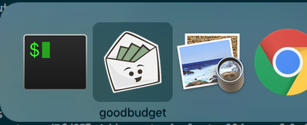

Standalone goodbudget app for OS X that starts goodbudget into the account view 

Keyboard shortcuts:

- cmd-shift-a: add transaction
- cmd-shift-i: import bank transactions
- cmd-shift-s: select all (useful when reconciling)

## Installation (Mac only for now)

Download and install from [latest binary](https://github.com/philippkeller/goodbudget-electron/releases/latest)

## Installation from source

If you are on Windows/Linux you need to install from source. 

Prerequisits:

- git
- node/npm
- on windows run `npm install --global --production windows-build-tools` in a root console first

### Start the app with electron

```
npm install -g electron
npm install
npm start
```

### Package it into a native app (OSX, Windows, Linux):

```
npm install electron-packager -g
electron-packager ./ goodbudget --overwrite --platform=darwin --arch=x64 --icon goodbudget.png.icns
rm -rf /Applications/goodbudget.app
mv goodbudget-darwin-x64/goodbudget.app /Applications/
```

### Package it for redistribution (mostly note to self)

```
npm install electron-builder -g
npm run dist
```

The installer is saved in `dist`
